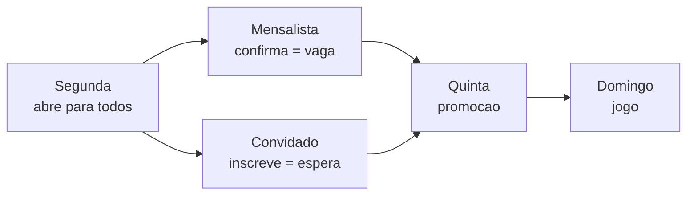

# TimeCerto — Visão Amadora: estrutura de telas

Especificação de reorganização da navegação do modo amador.
Documento vivo: https://claude.ai/code/artifact/0ce567c0-26ca-4c7c-8f67-573a263f9e2b

## O problema

O app tem 16 rotas e nenhum modelo de navegação. Cada tela é alcançada por um
botão específico de outra tela específica, e se volta por uma seta. Isso é uma
corrente, não uma estrutura — funcionava com cinco telas, não funciona com
dezesseis.

**`/amador` faz cinco trabalhos.** Escolher esporte, cadastrar jogador,
classificar mensalista ou convidado, marcar presença e lançar o jogo. O
cadastro de uma pessoa acontece uma vez; a presença acontece toda semana. Hoje
a tarefa frequente carrega o peso da tarefa rara.

**`InvitePage` tem 32 KB** e virou um segundo centro acidental — convites,
aprovações pendentes, links, e até o cadastro de mensalista. Não cresceu por
decisão: cresceu porque não havia outro lugar para pôr essas coisas.

**Não existe endereço para configuração nem financeiro.** Regra de vaga, valor
da mensalidade, local, horário, conta: nada tem lugar. `Expense` e `Payment`
estão tipados em `types/index.ts` desde o início, sem uma linha de tela.

## A barra de abas

Quatro abas fixas no rodapé, sem estatísticas. Cada uma é uma raiz de
navegação própria: entrar numa aba nunca joga o usuário para fora de onde ele
estava nas outras.

| Aba | Ícone | O que responde |
| --- | --- | --- |
| Jogo | `Volleyball` | O jogo de hoje: criar, convidar, sortear, pontuar |
| Atletas | `Users` | Quem é do grupo, e quem entra nele |
| Financeiro | `Wallet` | Quem pagou e quanto entrou |
| Ajustes | `Settings` | Como o grupo funciona |

**Quando a barra some.** Na tela do placar e na de sorteio. São telas de foco
total, usadas em pé — a barra rouba altura e convida a sair no meio de um
jogo. Saem por "Encerrar" ou pela seta, nunca por aba.

**Estado preservado por aba.** Trocar de aba e voltar mantém rolagem, busca e
filtro. Sem isso o organizador perde a posição na lista toda vez que confere um
valor no Financeiro.

**A aba Jogo é a inicial.** Abrir o app cai direto nela, não no menu de modos.
O menu Amador/Profissional passa a viver em Ajustes — trocar de modo é raro e
não merece bloquear a abertura toda vez.

## Aba Jogo

Responde "o jogo de hoje". É a tela mais usada do app e a única que precisa
funcionar com o celular numa mão, na beira da quadra.

O jogo tem ciclo: **criar → convidar → confirmar → sortear → pontuar**. A aba
acompanha esse ciclo e mostra só o que importa no estágio em que o jogo está.

### O jogo é uma entidade, não uma lista

Hoje presença é um booleano no jogador (`Player.present`) — existe um estado de
presença, nunca um jogo. Isso não sustenta o que a aba precisa fazer: convidar
para uma data, receber confirmações, e começar de novo na semana seguinte sem
apagar o histórico.

Precisa existir um **`Jogo`** com data, local, horário, vagas e a lista de
confirmações. `Player.present` deixa de ser a verdade e vira uma consequência
do jogo aberto. É a mudança de domínio desta etapa — sem ela, convite de jogo
não tem a que se referir.

### Os dois tipos de convite

São coisas diferentes e moram em abas diferentes:

| | Convite de jogo | Convite de cadastro |
| --- | --- | --- |
| Aba | **Jogo** | **Atletas** |
| Diz | "Tem jogo quinta, você vem?" | "Entra para o grupo" |
| Para quem | Quem já está cadastrado | Quem ainda não existe no app |
| Resultado | Uma confirmação | Um cadastro novo |
| Validade | Aquele jogo | Permanente |

Hoje os dois estão misturados na `InvitePage`, e o cadastro de mensalista
acabou morando dentro de "convites" — que por sua vez é alcançado pelo Elenco.
É essa cadeia que precisa ser desfeita.

### Blocos, de cima para baixo

1. **Partida em andamento**, quando existe. Faixa verde com o placar atual,
   leva ao placar.
2. **O jogo** — data, local, horário e vagas. Sem jogo aberto, este bloco é um
   botão "Criar jogo" que já vem preenchido com os padrões de Ajustes.
3. **Convidar** — botão que dispara o convite do jogo no WhatsApp. Dois
   destinos: mensalistas (todos de uma vez) e convidados (escolhidos da base).
4. **Confirmações** — `12 confirmados · 2 vagas · 3 na fila`, e a lista em três
   grupos: confirmados, fila de convidados, sem resposta. Toque alterna a
   confirmação manualmente, para quem respondeu por fora.
5. **Botão de ação fixo** — `Sortear (12)` como primário e `Partida direta`
   como secundário.
6. **Últimas partidas** — três linhas, só placar e data, com "ver todas".

### Decisões

**A linha do jogador aqui é mínima:** nome, selo de mensalista ou convidado, e
um toque. Sem estrela, sem seletor de posição, sem lixeira. Quem quiser mudar
nível ou função vai em Atletas — e quase ninguém quer, no minuto antes do jogo.

**O seletor de esporte sai daqui.** Vira configuração do grupo em Ajustes.

**Adicionar avulso continua aqui**, como botão discreto no fim da lista: chega
alguém de última hora e ninguém quer sair da tela. Cria um convidado só com o
nome; o resto se completa depois em Atletas.

## Aba Atletas

Responde "quem é do grupo, e quem entra nele". Tela de manutenção, usada
sentado, sem pressa — o oposto da aba Jogo. Aqui cabe formulário, campo longo e
confirmação.

O nome é **Atletas**, não Elenco: elenco é quem foi escalado, e isso é conceito
do modo profissional. Aqui são as pessoas do grupo, escaladas ou não.

### Desfazer a cadeia atual

Hoje o cadastro de mensalista mora dentro da `InvitePage`, que por sua vez é
alcançada pelo Elenco. Cadastrar alguém exige atravessar uma tela de convites —
duas ideias diferentes empilhadas porque o link precisava de um lugar.

O certo é o inverso: o cadastro é a tela, e o convite é um botão dentro dela.

### Duas listas, não uma

**Mensalistas** e **base de convidados** são cadastros de naturezas diferentes
e merecem seções separadas, com contagem própria.

O mensalista tem vínculo: paga fixo, tem vaga garantida quando confirma, e o
grupo conta com ele. O convidado é um conhecido que joga quando sobra vaga — e
a base existe para não redigitar o nome dele toda semana.

A distinção já é a régua de duas coisas: `lib/vagas.ts` decide quem entra no
jogo, e o Financeiro decide quem cobra de que jeito. Promover um convidado a
mensalista é uma ação de uma linha na ficha, e deve ficar visível — é o momento
em que o grupo ganha um membro.

### Blocos

1. **Busca**, acima de tudo, a partir de ~10 pessoas.
2. **Pendentes de aprovação**, quando houver. Bloco no topo, em âmbar, com
   aprovar e recusar na própria linha. Vem da `InvitePage`.
3. **Mensalistas** — lista com nome, apelido, função e nível. Cabeçalho da
   seção tem **Convidar mensalista**, que gera o link de cadastro.
4. **Convidados** — mesma linha, selo diferente. Cabeçalho tem **Adicionar
   convidado**, cadastro direto, sem link.
5. **Botão de cadastro manual** fixo no rodapé, para quem prefere digitar a
   ficha inteira.

### Por que o convite de cadastro fica aqui

Ele produz um cadastro, e cadastro é o assunto desta aba. O convite de jogo
produz uma confirmação e fica na aba Jogo. A regra para decidir qualquer dúvida
futura: **o convite mora onde mora a coisa que ele cria.**

### A ficha do jogador

Toque na linha abre uma folha com tudo: nome, apelido, telefone, nascimento,
nível, função, tipo e observações. Hoje isso está espalhado entre a linha da
lista e a `PlayerSheet`; consolidar numa folha só tira os seletores de dentro
da lista, que é metade da poluição visual da tela atual.

Telefone e nascimento continuam visíveis apenas para o administrador, como já
está marcado nos tipos.

## Aba Financeiro

Responde "quem pagou e quanto entrou". Não existe hoje. `Expense` e `Payment`
já estão em `types/index.ts` e nunca foram usados.

### As duas cobranças

A distinção mensalista/convidado já construída é exatamente a régua da
cobrança, e ela gera dois fluxos diferentes:

- **Mensalista** paga valor fixo por mês, independente de quantas vezes jogou.
  A cobrança nasce do calendário.
- **Convidado** paga por jogo em que entrou. A cobrança nasce da presença —
  `lib/vagas.ts` já sabe quem entrou de fato, e é esse dado que vira dívida.

Essa ligação é o coração da aba: hoje `vagas.ts` decide quem joga e ninguém
registra que aquilo gerou uma cobrança. Fechar o jogo deve oferecer, numa
linha, lançar a diária dos convidados que entraram.

### Blocos

1. **Resumo do mês** — três números: recebido, a receber, saldo depois das
   despesas. O saldo é o único em destaque.
2. **Quem deve** — lista ordenada por valor, com o botão de cobrar que abre o
   WhatsApp com a mensagem pronta. É o bloco mais usado e deve vir antes de
   qualquer gráfico.
3. **Despesas do período** — quadra, bola, água. Cada uma com valor, data e
   quem pagou.
4. **Lançar** — botão fixo que abre folha com duas opções: registrar pagamento
   recebido ou registrar despesa.

### Regras

**Valores sempre em centavos inteiros.** `amountCents` já está assim nos tipos.
Nunca ponto flutuante para dinheiro, em nenhuma operação intermediária —
divisão de rateio arredonda no fim, e a sobra de centavos vai para quem pagou a
despesa.

**Pagamento nunca é apagado, é estornado.** Histórico de dinheiro é onde
confiança se ganha ou se perde num grupo. Um lançamento errado vira um
contra-lançamento visível, não um sumiço.

**Sem integração de pagamento nesta etapa.** O app registra que entrou; quem
recebe é o organizador, pelo PIX dele. Chave PIX fica em Ajustes e entra na
mensagem de cobrança. Processar pagamento de verdade traz obrigação
regulatória e não é problema desta versão.

## Aba Ajustes

Responde "como o grupo funciona". Recebe tudo que hoje está espalhado ou
simplesmente não tem lugar.

### Seções

**O grupo** — nome, esporte (vindo do seletor que sai da aba Jogo), local, dia
e horário padrão.

**Vagas** — total de vagas por jogo, e se convidado entra em fila ou por ordem
de confirmação. São os parâmetros que `lib/vagas.ts` hoje decide sozinho, sem
ninguém poder mudar.

**Valores** — mensalidade, diária de convidado, chave PIX. Alimentam a aba
Financeiro e a mensagem de cobrança.

**Sorteio** — os padrões que hoje são perguntados toda vez na `DrawPage`:
jogadores por time, equilibrar por nível, equilibrar por posição. A `DrawPage`
continua existindo para ajuste pontual, mas abre já preenchida e vira um botão
só na maioria das semanas.

**Conta** — entrar, sair, sincronização. Absorve a `LoginPage`.

**Modo** — trocar entre Amador e Profissional. Absorve a `HomePage` como menu.

### A decisão embutida

Tirar o menu de modos da abertura muda o caráter do app: ele deixa de perguntar
quem você é toda vez e passa a lembrar. Quem usa o app é organizador de um
grupo, não alguém que alterna entre dois papéis — e um menu obrigatório antes
de cada uso é um pedágio pago por todos para servir a um caso raro.

## Mapa de migração

Nenhuma tela é jogada fora. Quase tudo muda de endereço.

| Tela atual | Vai para | Observação |
| --- | --- | --- |
| `HomePage` | Ajustes › Modo | Deixa de ser a abertura |
| `PlayersPage` | Divide em duas | Confirmação → Jogo; cadastro → Atletas |
| `InvitePage` (32 KB) | Divide em três | Cadastro e link → Atletas; convite de jogo → Jogo; pendentes → Atletas |
| `LoginPage` | Ajustes › Conta | Rota `/entrar` continua, para links |
| `DrawPage` | Jogo, com padrões de Ajustes | Vira um toque na maioria das vezes |
| `ResultPage` | Jogo | Sem mudança |
| `QuickMatchPage` | Jogo | Sem mudança |
| `ScoreboardPage` | Jogo, sem barra de abas | Tela de foco total |
| `MatchSummaryPage` | Jogo | Chegada natural do placar |
| `HistoryPage` | Jogo › ver todas | Não vira aba |
| `PlayerProfilePage` | Atletas | Some do amador se não houver scout |
| `GuestGroupPage` e irmãs | Fora das abas | São páginas públicas de link |
| — | **Financeiro** | Aba nova |
| — | **Ajustes** | Aba nova |
| — | **`Jogo` no domínio** | Entidade nova: data, vagas, confirmações |

### O caso das páginas de convidado

`/c/:code`, `/r/:code` e `/a/:token` são abertas por quem não tem conta, vindo
do WhatsApp. Elas não mostram barra de abas nem menu — quem chega ali tem uma
tarefa só e não é dono de nada. Continuam como estão, fora da estrutura.

## O grupo é o contexto

O app assume um grupo só, e guarda o modo na pessoa (`useAppStore.mode`). As
duas coisas estão erradas, e a segunda é a que trava a primeira.

### O modo pertence ao grupo

"Pelada de quinta" é um grupo amador. "Sub-17 feminino" é um time
profissional. O tipo é característica do grupo, não de quem o administra — a
mesma pessoa pode ter uma pelada e treinar um time.

Com o modo na pessoa, trocar de contexto exige dois passos: mudar o modo e
depois achar o grupo. Com o modo no grupo, é um passo: escolher o grupo. O app
se configura sozinho, com as abas e o vocabulário daquele tipo.

A tela de modo deixa de existir. A `HomePage` sai do fluxo de vez — o que já
estava previsto, agora por um motivo mais forte.

### O fluxo

**Entrar → escolher o grupo → o app se configura.**

Sem tela de modo no meio. O grupo escolhido define o tipo, as abas, o
vocabulário e o plano.

### A escolha não pode ser pedágio

A maioria dos administradores tem **um** grupo. Obrigar essa maioria a
atravessar uma tela de seleção em toda abertura, para servir a minoria que tem
dois, é cobrar de todos pelo caso raro — o mesmo erro do menu de modos.

O padrão certo:

- O app abre no último grupo usado.
- **O nome do grupo no cabeçalho é o seletor.** Toca e troca.
- A tela de escolha aparece só no primeiro login, ou quando não há grupo
  lembrado.

### Como isso encaixa no plano

O plano já é do grupo (`lib/plano.ts`), o que está certo: preço acompanhando
valor, e o técnico com quatro times pagando quatro vezes. Com o tipo também no
grupo, os dois andam juntos — e abre a porta para faixas diferentes por tipo,
se um dia o profissional valer mais que o amador.

## Multi-grupo: o que fazer agora e o que adiar

### O banco já aguenta

`group_members` é muitos-para-muitos e não há trava obrigando um grupo por
pessoa. Um usuário já pode ser membro de vários grupos hoje, com papéis
diferentes em cada um. Multi-grupo é problema exclusivamente do lado do app.

### O que trava do lado do app

Todo store persistido assume "o grupo": `useAppStore` guarda um elenco,
`useJogoStore` um conjunto de jogos, o financeiro um caixa. Nenhum deles sabe
a qual grupo pertence.

Fazer multi-grupo significa particionar cada store por grupo e migrar o que já
existe sem perder nada. É um refactor transversal — toca em tudo de uma vez.

### Por que adiar

Três motivos, em ordem de peso:

1. **Ninguém tem dois grupos ainda.** O app tem base pequena e nenhum caso real
   de multi-grupo. Construir agora é resolver um problema que ninguém tem.
2. **Colide com o que está em andamento.** Refactor transversal em paralelo com
   trabalho ativo na mesma área é conflito garantido.
3. **O banco já suporta, então nada está sendo fechado.** Adiar não cria dívida
   técnica nova — só mantém a que já existe.

### O que vale mover agora

Uma coisa só: **o tipo do grupo sai da pessoa e vai para o grupo.**

- Coluna `tipo` em `groups` (`'amador' | 'profissional'`), migração nova.
- Grupos existentes recebem o tipo que a pessoa tem hoje em `useAppStore.mode`.
- `useAppStore.mode` deixa de ser escolha do usuário e passa a derivar do grupo
  carregado.
- `TabLayout` lê o tipo do grupo, não o modo da pessoa.
- A `HomePage` sai do fluxo de abertura.

É uma migração pequena e contida, e tudo o mais assenta em cima dela. Quanto
mais semanas passam com o modo na pessoa, mais telas passam a lê-lo de lá e
mais caro fica arrancar.

### Quando multi-grupo entrar

O gatilho é o primeiro usuário real com dois grupos — não uma data. Quando
vier, o trabalho é:

- Um `grupoAtivo` (id) no topo, lembrado entre sessões.
- Cada store persistido passa a guardar por grupo, com a chave do localStorage
  incluindo o id.
- Migração: o conteúdo atual vira o conteúdo do único grupo existente.
- Seletor no cabeçalho; tela de escolha só no primeiro login.

## Ordem de implementação

Cada etapa deixa o app funcionando — nenhuma depende da seguinte para fazer
sentido. As etapas 1 a 3 estão feitas; o financeiro e o plano vieram junto,
fora de ordem.

**1. A barra de abas, com as telas de hoje.** ✓ Feita. `TabBar`, `TabLayout` e
`EmBrevePage`, com a barra escondida em `/placar` e `/sortear` e respeitando a
hidratação.

**2. Quebrar a `PlayersPage` em duas.** `JogoPage` fica com confirmação e os
botões de ação; `AtletasPage` fica com cadastro, mensalistas e convidados.
Renomear a aba Elenco para **Atletas**. Nenhuma funcionalidade nova — só
separar. Junto: tirar a seta de voltar das raízes de aba, usar o nome da aba
como título, e corrigir o contador da `DrawPage`, que anuncia mais jogadores em
quadra do que há presentes.

**3. A entidade `Jogo`.** Data, local, horário, vagas e confirmações.
`Player.present` deixa de ser a verdade e passa a derivar do jogo aberto.
Migrar o estado atual: quem está `present` hoje vira confirmação de um jogo
criado na migração, para ninguém perder a lista da semana.

**4. Separar os dois convites.** Convite de cadastro e seu link vão para
Atletas; convite de jogo nasce na aba Jogo, apoiado na entidade da etapa 3. A
`InvitePage` se dissolve. É a etapa de maior risco de regressão — os quatro
fluxos de link do WhatsApp dependem dela e precisam ser conferidos um a um
antes de fechar.

**5. Ajustes.** Grupo, vagas, valores, sorteio, conta, modo. Muitos valores já
existem em `useAppStore`; aqui ganham tela. Tirar o seletor de esporte da aba
Jogo só nesta etapa, quando já houver onde configurá-lo.

**6. Financeiro.** Store novo, telas novas, e a ligação com `lib/vagas.ts` no
fechamento do jogo. A maior de todas e a única que cria domínio financeiro.

**7. O tipo do grupo.** Coluna `tipo` em `groups`, `useAppStore.mode` passa a
derivar do grupo carregado, `TabLayout` lê de lá, e a `HomePage` sai do fluxo
de abertura. Pequena e contida — e fica mais cara a cada semana que passa.
Detalhe em **Multi-grupo: o que fazer agora e o que adiar**.

**8. Multi-grupo.** Só quando aparecer o primeiro usuário real com dois grupos.
Particionar os stores por grupo, seletor no cabeçalho, tela de escolha só no
primeiro login. Não é para esta semana.

### Para o Claude Code

Uma etapa por sessão. A etapa 2 é reorganização pura e deve sair sem nenhum
comportamento novo — se aparecer funcionalidade nova ali, alguma coisa saiu do
trilho. Da etapa 3 em diante há domínio novo.

Rodar a revisão do projeto ao fim de cada etapa. Prestar atenção especial à
hidratação: telas que decidem o que mostrar antes de o `localStorage` terminar
de ser lido repetem o bug que já custou a perda de partida em andamento.

## Inscrição em duas fases

O mensalista tem preferência para jogar. Hoje isso é implementado fora do app:
o administrador manda o link dos mensalistas num grupo de WhatsApp na terça, e
o dos convidados em outro grupo na quinta. A regra mora na disciplina dele de
lembrar o dia certo, e a lista desatualiza em um grupo sem o outro saber.

**A solução é abrir tudo de uma vez e promover depois.**

### Como funciona



Na abertura, mensalista que confirma entra direto como confirmado; convidado
que se inscreve entra na lista de espera. Na data da promoção, os convidados da
espera sobem para as vagas que sobraram, por ordem de inscrição.

### O que isso resolve

**Um link, um aviso, um dia.** A comunicação em dias diferentes deixa de
existir — e com ela a necessidade de dois grupos de WhatsApp. Os dois podem
virar um, se o administrador quiser.

**O convidado não leva um "volta quinta".** Ele se inscreve uma vez, na
segunda, e espera. Ninguém precisa lembrar de voltar.

**A demanda aparece desde o primeiro dia.** O administrador vê na terça quantos
convidados querem jogar, e decide com antecedência se vale abrir mais vagas ou
uma segunda quadra.

**A promoção vira um evento com hora marcada** — e por isso pode disparar um
aviso sozinha, que é a automação que hoje não existe.

## As regras da promoção

### Preferência vale até a promoção

**Decidido em 01/10.** Depois que a promoção acontece, vale ordem de chegada
para todos. O mensalista que confirma depois entra na lista de espera como
qualquer um — ele teve os dias de exclusividade e não usou.

A alternativa (mensalista sempre na frente, derrubando convidado já promovido)
foi descartada: desconvidar alguém que estava confirmado desde quinta magoa
mais do que nunca ter entrado.

**Isso é configurável por grupo.** Grupos com cultura diferente podem querer a
preferência permanente. O padrão é a regra acima.

### Quem não respondeu libera a vaga

Na hora da promoção, mensalista sem resposta **não segura vaga**. Sem isso,
convidado nunca entra: sempre vai haver alguém que não respondeu, e a vaga fica
presa.

É o que faz o prazo significar alguma coisa.

### O lembrete da véspera

Na noite anterior à promoção, aviso automático para quem ainda não respondeu:
*"falta você confirmar; amanhã sua vaga abre para convidados"*.

Resolve o esquecimento antes de virar problema, e é o tipo de coisa que faz o
organizador sentir que o app trabalha por ele.

### Configuração do grupo

Em Ajustes, valendo como padrão de todo jogo novo:

- **Dias antes do jogo em que a promoção acontece** (ex.: 3 — jogo domingo,
  promoção quinta).
- **Hora da promoção** (ex.: 20h).
- **Preferência do mensalista depois da promoção**: acaba (padrão) ou
  permanece.

Cada jogo nasce com esses valores e pode ajustá-los.

### O que a promoção exige do servidor

**Este é o ponto que decide se a automação é real.** A promoção acontece na
quinta às 20h, com o celular de todo mundo fechado. Um PWA não roda nada nesse
momento.

Precisa acontecer no servidor: `pg_cron` no Supabase, ou função agendada. Já
existe precedente com a `enviar-aviso`.

**Sem agendador, a saída é promover de forma preguiçosa** — na primeira vez que
alguém abre o link depois da hora marcada. A lista fica certa, mas o aviso não
dispara sozinho, e o aviso é metade do valor. Vale como primeiro passo, não
como solução final.

### Casos de borda

**Mais convidados do que vagas.** Promove por ordem de inscrição até encher; o
resto continua na espera, agora com posição visível.

**Desistência depois da promoção.** Já funciona: abre vaga e chama o próximo da
espera.

**Jogo criado em cima da hora**, com a data de promoção já no passado: promove
na criação, sem esperar nada.

**Administrador quer antecipar.** Botão de promover agora, para quando ele vê
que faltam pessoas e não quer esperar a quinta.

### Implementação

**Etapa A, feita em 03/10/2026 (migração 028).** Nada muda para o grupo que
não configurar: `promoverEm` nulo roda o caminho de sempre, no app e no
banco.

- **A regra** mora em `distribuirVagas` (lib/vagas.ts), que ganhou a
  promoção como parâmetro, e na cópia do banco, `convidados_com_vaga`, que
  ganhou um ramo. Nada de "quem foi promovido" é guardado: sai da hora da
  promoção e da hora de cada resposta. Passada a hora marcada, a regra já vale
  mesmo sem marca; a marca (`promovido_em`) é o que dispara a diária
  antecipada e, na etapa B, os avisos. Com a preferência permanente, depois da
  promoção vale a regra de sempre.
- **A promoção preguiçosa**: a rodada de sincronização do administrador
  (`promover_vencidos`) e a abertura do link (`guest_promover`) marcam o
  jogo que passou da hora. Jogo criado depois da hora já nasce promovido.
- **A diária antecipada** passa a nascer na promoção, nos grupos configurados.
- **Tela**: Ajustes › Inscrição em duas fases; o formulário do jogo traz
  "Convidados entram em" e a preferência, do padrão do grupo; o cartão e a
  página do jogo mostram a fase, com "Promover agora"; o link explica a regra
  e dá a posição na espera.
- **Provas**: 18 regras em tsx (o script ficou fora do repositório, como os
  outros `_teste`), 13 no Postgres contra o schema completo, e o fluxo
  inteiro em 390×844 — criar o jogo, confirmar mensalistas, inscrever
  convidados, promover, conferir a lista, e o mensalista atrasado entrando na
  fila sem derrubar ninguém.

**Etapa B, feita em 03/10/2026 (migração 029).** Os avisos saem pela caixa de
sempre (`avisos` → Database Webhook → `enviar-aviso`), só para quem ativou
o aviso no celular.

- **Na promoção**, de um gatilho em `promovido_em` — então saem uma vez só,
  venha a promoção do agendador, do link, da rodada do administrador ou do
  "Promover agora": "você tem vaga" para quem subiu, "você é o Nº da espera"
  para quem ficou (`fila_da_promocao`, a mesma conta de vagas), "abriu para
  convidados, N vagas" para os convidados do grupo que não se inscreveram
  (só se sobrou vaga), e o resumo para os administradores.
- **Preferência permanente**: o convidado que um mensalista atrasado derrubou
  recebe "você voltou para a espera".
- **Véspera**: nas 24 h antes da promoção, o mensalista que não respondeu
  recebe "falta você confirmar" — uma vez, marcado em
  `lembrete_promocao_em`.
- **O agendador**: `promover_e_lembrar()`, a cada 5 minutos pelo `pg_cron`.
  A promoção preguiçosa da etapa A continua como rede de segurança, para
  quando o agendador falhar.

Provas: 15 no Postgres contra o schema completo, com todos os jogadores
inscritos nos avisos para ver exatamente o que entra na caixa.

## Um link só

Decidido pelo Guilherme em 04/10/2026. A maioria dos grupos tem **um** grupo
de WhatsApp, o dos mensalistas — então o link dos mensalistas é o link do
jogo. O mensalista procura o nome e confirma; quem não é mensalista se
inscreve como convidado ali mesmo, porque o mensalista mandou o link para ele
ou porque o mensalista o levou ("Levar alguém de fora", como antes).

- **O link reconhece o histórico**: os nomes que já responderam daquele
  celular aparecem no alto, com "Sou eu".
- **A busca**: digitar filtra os mensalistas; convidado só aparece quando bate
  com o que foi digitado — a lista inteira de convidados continua sem ficar
  exposta (a mesma decisão do "Você é…?", de 29/09/2026).
- **O link dos convidados continua vivo**, para quem tem dois grupos. Na tela
  do jogo os botões viraram "Convidar para o jogo" e "Link só de convidados".

### A trava do nome (migração 030)

Um link só mostra os nomes dos mensalistas para todo mundo — e, com a
promoção, dá motivo para confirmar no nome de quem ainda não respondeu.

- **Em cada jogo, o primeiro celular que responde por um nome fica com ele.**
  Outro celular não muda aquela resposta e vê: "Este nome já foi respondido de
  outro celular neste jogo." No jogo seguinte começa do zero.
- **O organizador é a saída**: quando ele muda a resposta pelo app (ou a fila
  de espera anda sozinha), a trava solta.
- **Quem foi chamado da espera** confirma de qualquer celular — o chamado é do
  organizador, numa mensagem direta.
- O celular é um número aleatório guardado no aparelho (`lib/aparelho.ts`),
  não identifica ninguém.

Não pega quem chega primeiro no nome de outro. O que sobra, a lista pública
mostra: o mensalista que não confirmou e aparece como "vou" percebe — e, ao
tentar responder, descobre que o nome dele foi usado.

**Próximo passo possível, não decidido**: entrar com o Google no link. Aí o
nome fica preso à CONTA, não ao celular — resolve também quem chega primeiro e
quem troca de celular. O preço é o atrito: muita gente de pelada não vai
fazer login para marcar presença.

## A mensalidade no grupo

Decidido pelo Guilherme em 05/10/2026. Com mensalidade configurada, "Cobrar no
grupo" manda a mensalidade do mês, não mais a lista de pendências:

```
⚡ Maverick · Mensalidade de Outubro/2026

Vencimento: dia 10/10
Valor: R$ 80,00

• Ana ✅
• Beto

Pix: (chave do grupo)

Quando fizer o pagamento, entre no link abaixo e confirme o pagamento.
(link do jogo)
```

- **O ✅** vai em quem já pagou (baixa do administrador, inclusive em dinheiro)
  e em quem informou pelo link. "Pago" segue a regra de sempre: o pagamento
  abate as cobranças mais antigas primeiro.
- **No link do jogo**, o mensalista vê a mensalidade do mês, copia o Pix já com
  o valor e toca em **"Já paguei"**. Depois aparece "Mandar a lista da
  mensalidade no grupo", com o ✅ no nome dele.
- **Informar não é baixa** (migração 031, `cobrancas.informado_em`): no
  Financeiro o cartão diz "Informou que pagou · a conferir"; o administrador
  confere no extrato e registra o pagamento. Se o dinheiro não chegou, "Não
  recebi" tira o ✅.
- Grupo sem mensalidade continua com a mensagem de pendências antiga.

