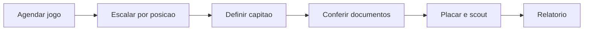

# TimeCerto — Visão Profissional: atletas, documentos e jogo

Documento vivo: https://claude.ai/code/artifact/16a62881-9832-4a3d-b6ce-5ea927e17806

## O escopo

Seis frentes na visão profissional. Cinco são trabalho normal de produto.
**Uma muda a natureza do risco do app inteiro** e precisa de decisão antes de
linha de código.

| Frente | Tamanho | Risco |
| --- | --- | --- |
| Múltiplas posições por atleta | Pequeno | Toca a validação da escalação |
| Campo de CPF | Pequeno | Dado pessoal forte |
| **Guardar imagem de RG e CPF** | Médio | **Alto — decide antes de começar** |
| Escanear documento | Médio | Multiplica o risco acima |
| Escalação no jogo, com capitão | Médio | Liga `Jogo` e `Lineup` |
| Relatório do jogo | Médio | Nenhum |

### O item que pesa

Guardar foto de RG de atleta é diferente de tudo que o app faz hoje. Até agora
o pior vazamento possível seria uma lista de nomes e telefones de um grupo de
vôlei. Com documentos guardados, o pior caso vira **uma pasta de RGs — boa
parte de menores de idade — exposta na internet**.

Não é motivo para não fazer: a necessidade é real, competição exige
conferência de documento na mesa. É motivo para fazer de um jeito específico,
e para decidir isso agora e não depois de já ter mil imagens guardadas.

## Guardar CPF e documento

Não sou advogado, e o texto de consentimento e a política de retenção merecem
uma olhada profissional antes de ir ao ar — principalmente por causa dos
menores. O que segue é análise técnica e de produto.

### O que muda

CPF e imagem de documento são dados pessoais sob a LGPD. A imagem é pior que o
número: um RG traz foto, filiação, assinatura e órgão emissor — material
suficiente para abrir conta no nome de alguém.

**O agravante é a idade.** O app já tem `AgeGroup` com categorias de base.
Dados de criança e adolescente têm regime próprio na LGPD: exigem
consentimento específico e destacado do responsável, e tratamento no melhor
interesse do menor. Um cadastro de sub-15 com RG anexado é exatamente o caso
que a lei trata com mais rigor.

Guardar isso cria obrigações contínuas: proteger, limitar acesso, apagar
quando pedirem, e comunicar vazamento. Nenhuma delas é opcional por o app ser
pequeno.

### A pergunta que vem antes

**O que o técnico precisa na mesa: o documento físico, ou a informação dele?**

Na maioria das federações o que vale na mesa é o documento físico ou a
carteira da federação. O app não substitui isso. O que ele resolve de verdade
é outra coisa: **o técnico saber, antes de sair de casa, quem está com
documento pendente.**

Se for esse o problema, a solução é muito mais barata e quase sem risco: um
campo de CPF e um selo de "documento conferido", com data e por quem. Zero
imagem guardada, e o técnico sai de casa sabendo quem falta.

Vale confirmar com quem vive a mesa antes de construir o cofre.

### Se for guardar imagem mesmo assim

Seis regras, todas obrigatórias juntas:

1. **Bucket privado, nunca público.** Supabase Storage com RLS por grupo.
   Acesso só por URL assinada de vida curta — minutos, não dias.
2. **Só administrador do grupo vê.** Nem outros atletas, nem o próprio atleta
   por link público.
3. **Consentimento no momento do envio**, com texto claro do para quê e por
   quanto tempo. Menor de idade: consentimento do responsável, registrado com
   data.
4. **Prazo de descarte.** Documento de temporada se apaga no fim da
   temporada. Sem prazo, a pasta só cresce e o risco só aumenta.
5. **Apagar de verdade**, do banco e do storage, quando o atleta sai ou pede.
   Botão visível, não pedido por e-mail.
6. **Nunca no cache do aparelho.** Sem download automático, sem miniatura
   persistida, sem `localStorage`.

### CPF sem imagem

Mesmo o CPF sozinho pede cuidado: validar o dígito na entrada, guardar só
dígitos, mostrar mascarado (`***.456.789-**`) para quem não é administrador, e
manter fora de qualquer exportação que saia do app — inclusive o relatório do
jogo.

## Escanear o documento

Três caminhos, e eles diferem menos em dificuldade do que em exposição.

| Caminho | Precisão em RG brasileiro | Onde a imagem passa | Custo |
| --- | --- | --- | --- |
| OCR no próprio aparelho (Tesseract.js) | Baixa | Nenhum lugar | ~2 MB no pacote |
| OCR na nuvem (Google Vision, Textract) | Alta | Terceiro fornecedor | Por imagem, e um processador novo a declarar |
| Digitação manual | Perfeita, se conferida | Nenhum lugar | Zero |

RG brasileiro é ruim para OCR: cada estado tem um leiaute, muitos são antigos,
plastificados e com brilho. CPF em cartão é mais fácil, mas quase ninguém tem
o cartão — o número vem da CNH ou do próprio RG novo.

### O meio-termo que resolve

Existe um caminho que dá a comodidade sem a dívida: **ler o CPF pela câmera e
descartar a imagem na hora.**

A pessoa aponta a câmera, o app extrai o número, mostra para conferência, e a
foto nunca é gravada em lugar nenhum. O ganho de digitação é o mesmo; o
passivo é zero.

### Recomendação

**Adiar o escaneamento.** Digitação de CPF com validação de dígito resolve o
cadastro de um elenco inteiro em poucos minutos, uma vez por temporada. O
escaneamento economiza esses minutos e, em troca, adiciona ou uma dependência
de nuvem que vê documentos, ou 2 MB de pacote com precisão ruim.

Se for fazer, que seja o meio-termo acima — câmera, extrai, descarta — e
depois que o cadastro simples estiver rodando.

## Cadastro do atleta

### Múltiplas posições

Hoje `ProPlayer.position` é um campo só. No vôlei real isso é exceção:
ponteiro que joga de oposto, central que vira ponteiro na base. Passa a ser
uma lista.

```
positions: string[]   // em ordem de preferência; a primeira é a principal
```

**A ordem importa e não é detalhe.** A primeira posição é onde o atleta joga
por padrão; as outras são onde ele quebra galho. Sem ordem, o app não sabe
qual usar ao sugerir uma escalação.

**O que isso quebra:** `validateLineup` em `lib/court.ts` conta levantadores
comparando `positions[sport] === 'levantador'`. Com lista, a conta muda — e
muda de um jeito que precisa de decisão: um atleta que tem levantador como
**segunda** posição conta para o 5x1?

A resposta certa é **não conta como erro, mas gera aviso**. Um time que escala
como levantador alguém cuja posição principal é outra está improvisando — pode
ser proposital, e o app não deve bloquear. Mas o técnico precisa ver que está
improvisando.

O mesmo vale para o preenchimento automático: `autoFill` prefere quem tem a
posição como principal, e só recorre à segunda quando não há outra saída.

### CPF

Campo novo em `ProPlayer`, com:

- Validação de dígito verificador na entrada — errar um número e só descobrir
  na mesa é o pior caso.
- Armazenado só com dígitos, sem pontuação.
- Exibido mascarado para quem não é administrador.
- Fora de qualquer exportação.

### Status de documentação

Independente de guardar imagem ou não, o campo que resolve o problema prático
é este:

```
documentacao: 'pendente' | 'conferida'
conferidaEm?: string
conferidaPor?: string
```

É o que permite a lista de "quem está com documento pendente" — a pergunta que
o técnico faz na véspera do jogo.

## Escalação ligada ao jogo

Hoje a `LineupPage` vive solta: monta uma quadra e manda direto para o placar.
A escalação não pertence a nada, some quando a partida acaba, e não dá para
preparar na véspera.

Com a entidade `Jogo` já existindo, ela ganha dono:



A escalação passa a ser preparada quando o jogo é agendado, revista até a
hora, e guardada junto do jogo depois. É o que permite comparar a escalação
planejada com a que de fato jogou.

### Capitão não é do atleta

A tentação é pôr um campo `capitao: boolean` no `ProPlayer`. Está errado.

Capitão é um papel **daquele jogo**: muda quando o titular não vai, quando é
amistoso, quando o técnico quer dar a braçadeira para alguém. Um campo no
atleta transforma uma decisão por partida em uma característica permanente, e
obriga a lembrar de trocar toda vez.

```
Lineup.capitaoId?: string
```

Regra: o capitão precisa estar entre os que começam em quadra ou no banco
daquele jogo. Se ele sair da escalação, o campo se limpa sozinho — capitão
fantasma no relatório é o tipo de erro que só aparece na mesa.

### Escalar por posição

A quadra das seis posições já existe e funciona (`lib/court.ts`). O que muda é
de onde ela nasce: em vez de começar vazia, abre sugerida a partir das
posições cadastradas dos atletas confirmados, respeitando o sistema de jogo.

Com múltiplas posições, a sugestão prefere a posição principal de cada um e só
usa a secundária quando falta gente.

## Documentos do jogo

O pedido — "buscar documentos do cadastro" — na prática é uma tela só: **a
conferência da véspera.**

Dentro do jogo agendado, uma lista dos escalados com o status de documentação
de cada um. Quem está conferido aparece discreto; quem está pendente aparece
em âmbar, no topo.

A pergunta que a tela responde é uma: **quem pode ter problema na mesa?**

### Se houver imagem guardada

O acesso vem daqui, e só daqui: toque no atleta pendente, URL assinada de vida
curta, imagem aberta no visualizador, nada gravado no aparelho. Sem botão de
baixar tudo, sem galeria — essas são justamente as portas por onde um acervo
inteiro vaza de uma vez.

### Se não houver

A tela funciona igual, com o selo de conferido em vez da imagem. O técnico
sabe quem falta e cobra por WhatsApp. **Vale começar por aqui e só depois
decidir se a imagem faz falta de verdade** — pode ser que não faça.

## Relatório do jogo

O scout já registra tudo e o resumo já existe na tela. O que falta é tirar
isso do app — para o grupo do WhatsApp, para a coordenação, para o arquivo do
técnico.

### O que entra

Cabeçalho com times, data, local e resultado por set. Escalação inicial com as
posições e o capitão marcado, mais as substituições. De onde vieram os pontos,
por time. Erros cometidos por fundamento. E a tabela por atleta: pontos,
erros, saldo.

**O que não entra: CPF, documento, telefone, nascimento.** O relatório sai do
app e vai parar em grupo de WhatsApp — tudo que nele estiver, está público. A
regra é simples: se o dado é protegido dentro do app, ele não pode sair num
arquivo.

### Formato

**PDF**, e por um motivo prático: é o único que imprime igual, abre em
qualquer celular e não perde formatação no WhatsApp. O projeto já tem a skill
de PDF.

Vale um segundo formato depois, se pedirem: **imagem única** do resumo, que
cola direto na conversa sem ninguém precisar abrir anexo. Mas PDF primeiro.

### Uma decisão de plano

Exportar relatório é candidato natural a recurso pago do lado profissional — é
entregável de trabalho, não conveniência de pelada. Vale decidir isso antes de
construir, porque muda onde a trava entra.

## Ordem de implementação

Do mais barato ao mais arriscado. As três primeiras entregam a maior parte do
valor sem nenhum passivo novo.

**P1. Múltiplas posições.** `ProPlayer.positions` vira lista ordenada. Ajustar
`validateLineup` (posição secundária vira aviso, nunca erro) e `autoFill`
(prefere a principal). Migração: o campo atual vira o primeiro item da lista.

**P2. CPF e status de documentação.** Campo de CPF com validação de dígito,
mascarado para não-administrador. Selo de documentação conferida, com data e
autor. Sem imagem nenhuma.

**P3. Escalação ligada ao jogo, com capitão.** `Lineup` passa a pertencer ao
`Jogo`, preparada no agendamento. `capitaoId` na escalação, nunca no atleta.
Tela de conferência da véspera, listando quem está pendente.

**P4. Relatório do jogo em PDF.** Cabeçalho, sets, escalação com capitão,
substituições, de onde vieram os pontos, erros por fundamento e tabela por
atleta. Sem nenhum dado protegido.

**P5. Guardar imagem de documento** — só se, depois do P2 e do P3 rodando, a
falta da imagem se mostrar um problema real. Exige as seis regras da seção de
documentos, consentimento com texto revisado, e prazo de descarte definido
antes da primeira imagem entrar.

**P6. Escanear** — só depois de tudo acima, e no formato que descarta a
imagem.

### Para o Claude Code

Uma etapa por sessão. P1 e P2 são contidas. P3 toca `Jogo`, `Lineup` e
`court.ts` ao mesmo tempo — vale começar lendo os três.

P5 e P6 não são tarefa de implementação até que a decisão de produto e o texto
de consentimento existam. Não comece por eles.
